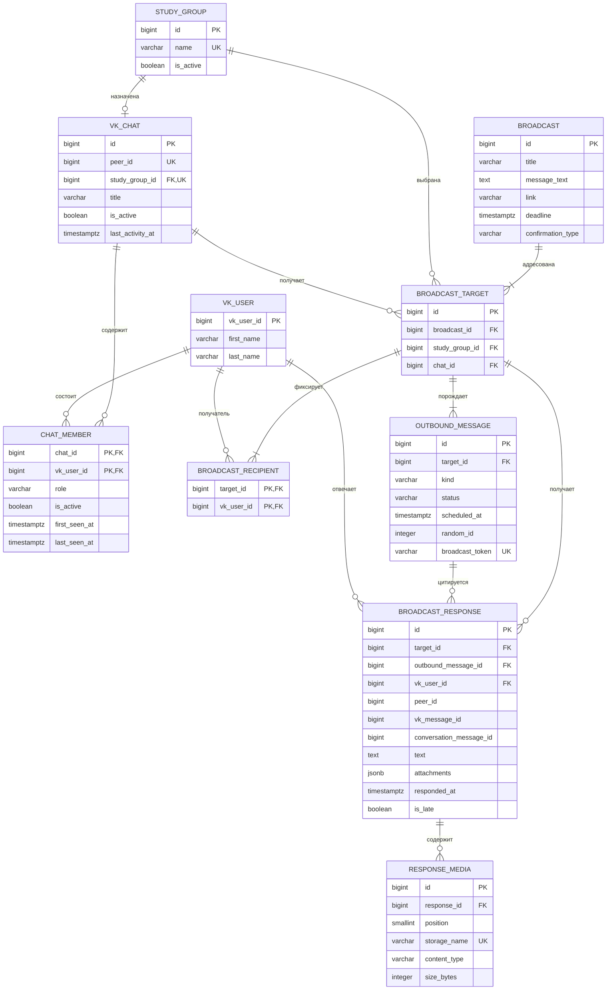

# Database

Все даты хранятся в PostgreSQL как `timestamp with time zone` в UTC.

- `vk_chats` создаётся при обнаружении события VK и позднее связывается с одной учебной группой.
- `vk_chats.last_activity_at` монотонно хранит время последнего принятого сообщения или реакции из беседы.
- Составной ключ `chat_members` не допускает повторного членства пользователя в одной беседе.
- `role`: `unknown`, `student`, `tutor` или `leader`. Новые участники получают `unknown` до классификации.
- `broadcast_recipients` хранит неизменяемый снимок активных первокурсников на момент создания рассылки.
- `outbound_messages` является PostgreSQL outbox: начальная отправка планируется сразу, напоминание — за 24 часа до дедлайна, если этот момент ещё не прошёл.
- Уникальность `(target_id, kind)` не допускает повторного создания основной отправки или напоминания; `status`, `attempt_count`, `sent_at` и `last_error` используются для контроля доставки и ручного retry.
- `broadcast_responses` хранит последнее подходящее сообщение или реакцию каждого получателя; уникальный `(target_id, vk_user_id)` и монотонный `conversation_message_id` делают обработку Long Poll идемпотентной.
- `response_media` хранит метаданные локальных копий изображений; сами файлы находятся в Docker volume.
