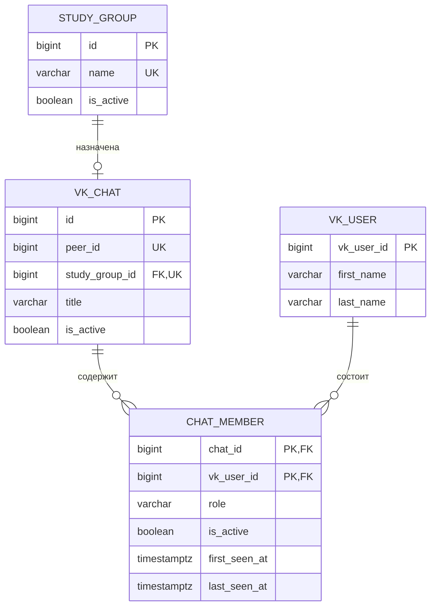

# Database

Все даты хранятся в PostgreSQL как `timestamp with time zone` в UTC.

- `vk_chats` создаётся при обнаружении события VK и позднее связывается с одной учебной группой.
- Составной ключ `chat_members` не допускает повторного членства пользователя в одной беседе.
- `role`: `unknown`, `student`, `tutor` или `leader`. Новые участники получают `unknown` до классификации.
